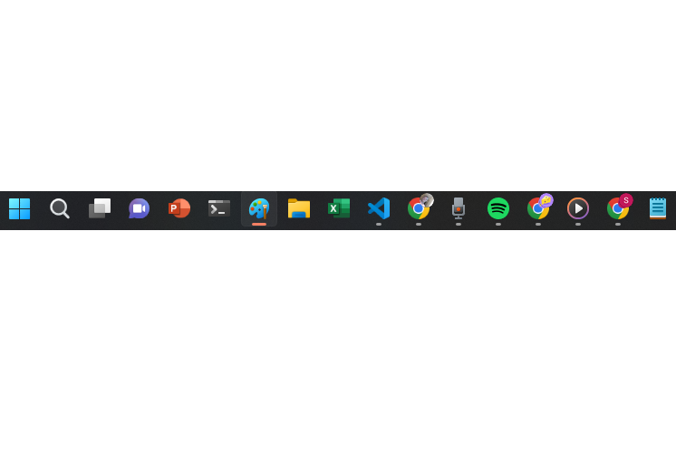
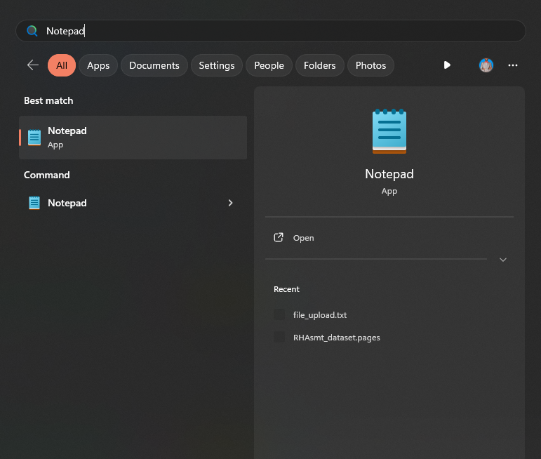
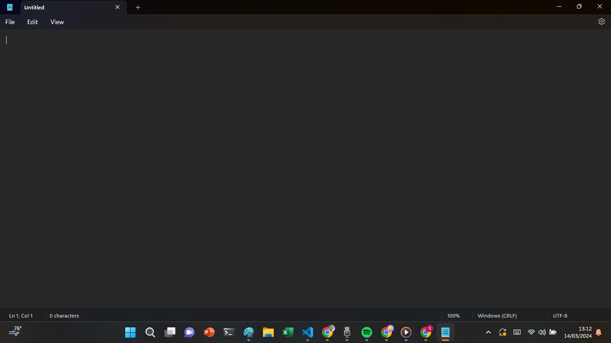
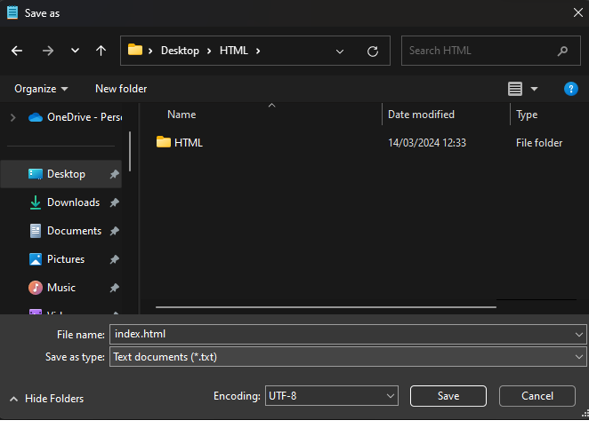
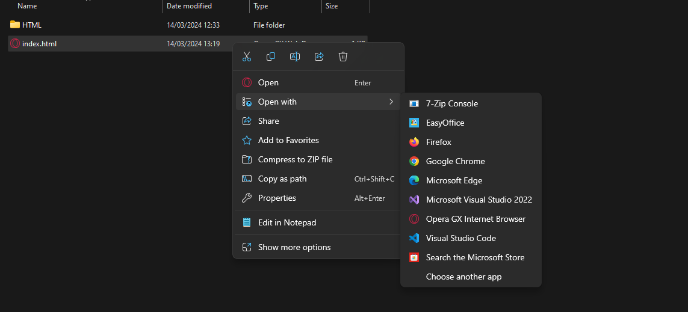
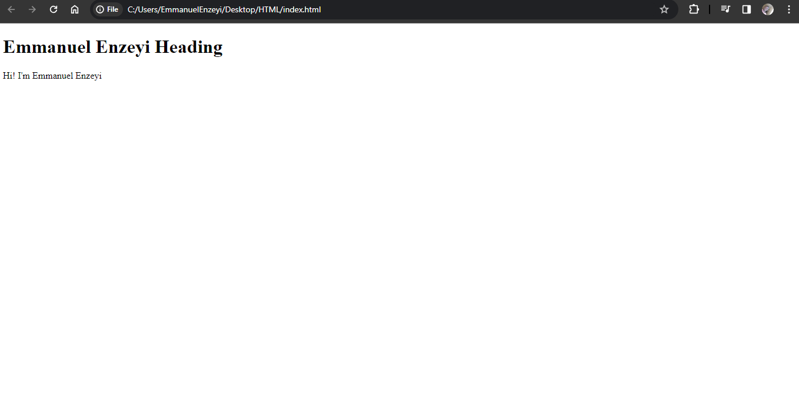

# HTML Best Editor To Use When Learning
A simple text editor is all you need t learn HTML.

Web pages can be created and modified by using professional HTML editors like VS Code.

When learning HTML however a simple text editor like Notepad(PC) and TextEdit(Mac) are highly recommended.

## Step 1: Open Notepad
Open start screen (The windows symbol at the bottom left on your screen). Type **Notepad**

## Step 2: Write the HTML code
Write or copy the following HTML code into Notepad
'''<!DOCTYPE html>
<html>
<body>
<h1>Emmanuel Enzeyi Heading</h1>

Hi! I'm Emmanuel Enzeyi

</body>
</html>'''

## Step 3: Save the HTML Page
Save the HTML Page
Select **File>>Save As** in the notepad.
Name the file **index.html** and set the encoding to **UTF-8** (The preferred encoding for HTML files)

## Step 4: View The HTML Page in your browser
Open File Location
Right Click, then select, open by, from the list choose which browser to use

The results will be opened up in a browser, see example below

